# Image Manipulation Software

A desktop GUI image processing application written in **C** using the **IUP 3.32** GUI toolkit. Designed for manipulating 24-bit uncompressed BMP images with real-time preview, filtering, transformations, and undo support.

---

## 🚀 How to Run the Project

You can run the project in two ways:

### Option 1: Double-Click the Executable (No Setup Required)
- Navigate to the `FINAL_PROJECT` folder in Windows File Explorer.
- Double-click **`ImageEditor.exe`** to launch the application immediately.

### Option 2: Build & Run from Command Line
If you have GCC (MinGW-w64) installed and want to compile from source:
1. Open PowerShell or Command Prompt in the `FINAL_PROJECT` directory.
2. Run the build script:
   ```cmd
   .\build.bat
   ```
   *(Or `./build.bat` in bash / Git Bash)*
3. The script will automatically compile all source files, link required libraries, and launch `ImageEditor.exe`.

> **Note:** Sample 24-bit BMP images (such as `lena.bmp`) are provided in the [`pics/`](pics/) folder for quick testing.

---

## ✨ Features & Functionality

### 1. File Operations
- **Open Image (`Ctrl+O`)**: Opens standard 24-bit uncompressed BMP images via native Windows file dialog. Supports both bottom-up and top-down row layouts and handles row byte padding.
- **Save Image As... (`Ctrl+S`)**: Saves the modified image to a new 24-bit BMP file with correct BMP headers and padding.
- **Exit (`Alt+F4`)**: Closes the application with proper memory cleanup.

### 2. Filters & Image Processing
- **Grayscale**: Converts the image to grayscale using luminance weighting:
  $$\text{Gray} = 0.299 \times R + 0.587 \times G + 0.114 \times B$$
- **Brightness Adjustment**: Prompts for a brightness shift value (between `-255` and `+255`) and clamps RGB results between `0` and `255`.
- **Invert Colors (Negative)**: Inverts all pixel color channels ($255 - \text{channel}$).
- **Horizontal Flip**: Mirrors the image horizontally across the vertical center axis.
- **Vertical Flip**: Flips the image upside-down across the horizontal center axis.
- **Rotate 90° CW**: Rotates the image 90 degrees clockwise and adjusts dimensions accordingly.
- **Crop**: Interactive dialog to specify rectangular crop coordinates `(X1, Y1)` to `(X2, Y2)` with image boundary validation.
- **Box Blur**: Applies a $3 \times 3$ smoothing filter that averages adjacent pixel colors to soften details and reduce noise.
- **Sharpen Filter**: Applies a $3 \times 3$ edge enhancement convolution kernel:
  $$\begin{bmatrix} 0 & -1 & 0 \\ -1 & 5 & -1 \\ 0 & -1 & 0 \end{bmatrix}$$

### 3. User Interface & Extras
- **Undo (`Ctrl+Z`)**: Easily revert the last applied filter or transformation.
- **Quick Toolbar**: One-click action buttons with tooltips for rapid editing.
- **Canvas Display**: Dark-themed canvas with automatic image centering and aspect-ratio scaling.
- **Live Status Bar**: Displays current operation status, loaded filename, dimensions, and color depth.

---

## 📁 Project Structure & Source Code Breakdown

```text
FINAL_PROJECT/
├── ImageEditor.exe         # Precompiled 64-bit Windows executable
├── build.bat               # Windows batch script to compile and launch the app
├── pics/                   # Sample test images (lena.bmp, etc.)
├── include/                # IUP 3.32 header files
├── lib/                    # IUP 3.32 static libraries for Win64 linking
└── src/                    # Application source code
    ├── main.c              # Application entry point
    ├── header/             # Project header declarations
    │   ├── image.h         # Pixel/Image structs and BMP handling prototypes
    │   ├── filter.h        # Image filter and transformation prototypes
    │   └── gui.h           # GUI window builder and cleanup prototypes
    └── programs/           # Core implementation logic
        ├── image.c         # BMP loading, saving, and memory management
        ├── filter.c        # Implementation of image filter algorithms
        ├── gui.c           # IUP GUI layout, menus, callbacks, and canvas drawing
        └── ucrt_compat.c   # Compatibility shim for linking IUP with modern UCRT
```

### Purpose of Each File in `src/`

| File | Path | Description & Role |
| :--- | :--- | :--- |
| **`main.c`** | [`src/main.c`](src/main.c) | Initializes the IUP GUI environment (`IupOpen`), creates the main application window, starts the event loop (`IupMainLoop`), and cleans up allocated memory upon exit. |
| **`image.h`** | [`src/header/image.h`](src/header/image.h) | Declares the `Pixel` (RGB) and `Image` structures, along with functions to allocate, free, clone, read, and write BMP files. |
| **`filter.h`** | [`src/header/filter.h`](src/header/filter.h) | Declares function prototypes for all image processing filters (grayscale, brightness, inversion, flips, rotation, crop, blur, sharpen). |
| **`gui.h`** | [`src/header/gui.h`](src/header/gui.h) | Declares functions for building the IUP dialog (`build_main_gui`) and cleaning up active image handles (`cleanup_images`). |
| **`image.c`** | [`src/programs/image.c`](src/programs/image.c) | Implements raw 24-bit BMP decoding/encoding, handles `BMPFileHeader` and `BMPInfoHeader`, calculates 4-byte row padding, and manages pixel buffer allocations. |
| **`filter.c`** | [`src/programs/filter.c`](src/programs/filter.c) | Implements pixel-level manipulation algorithms including color conversions, coordinate transformations (flips, rotation, crop), and $3 \times 3$ convolution matrices (blur and sharpen). |
| **`gui.c`** | [`src/programs/gui.c`](src/programs/gui.c) | Constructs the IUP user interface (menu bar, toolbar, canvas, and status bar), attaches callbacks, maintains undo state, and renders the active image to the screen. |
| **`ucrt_compat.c`** | [`src/programs/ucrt_compat.c`](src/programs/ucrt_compat.c) | Provides compatibility symbols (`__imp___argc`, `__imp___argv`) required when linking IUP static libraries against modern Windows Universal C Runtime (UCRT). |

---

## 📸 Screenshots

<table>
  <tr>
    <td align="center"><b>Application UI</b><br>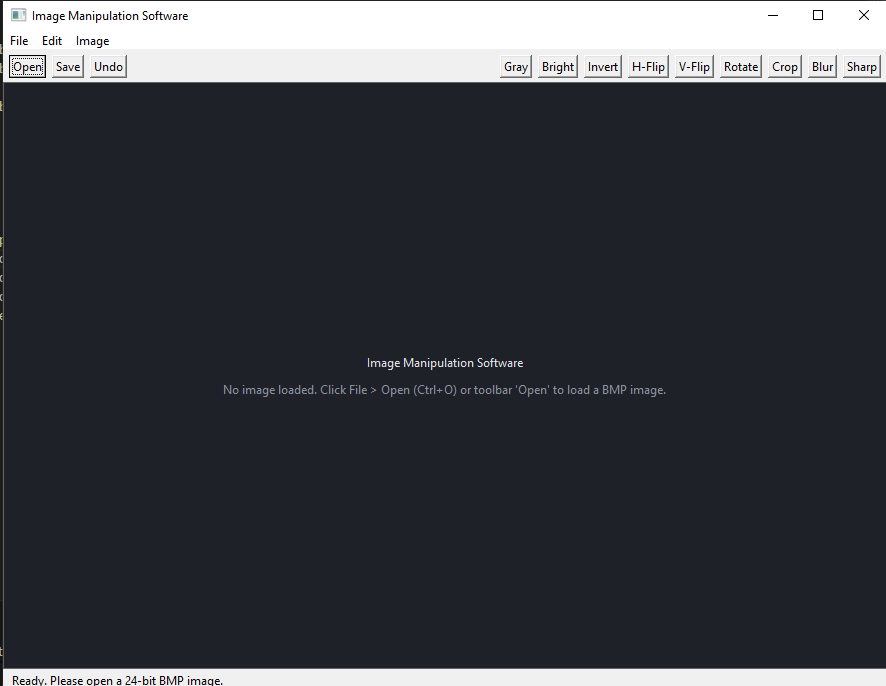</td>
    <td align="center"><b>Loading an Image</b><br>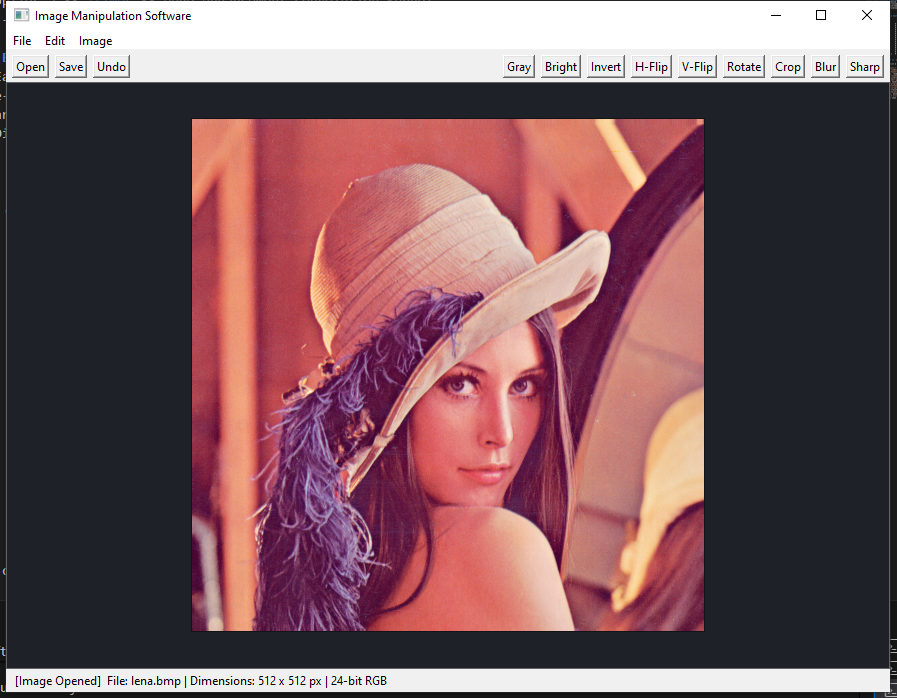</td>
    <td align="center"><b>Grayscale Filter</b><br>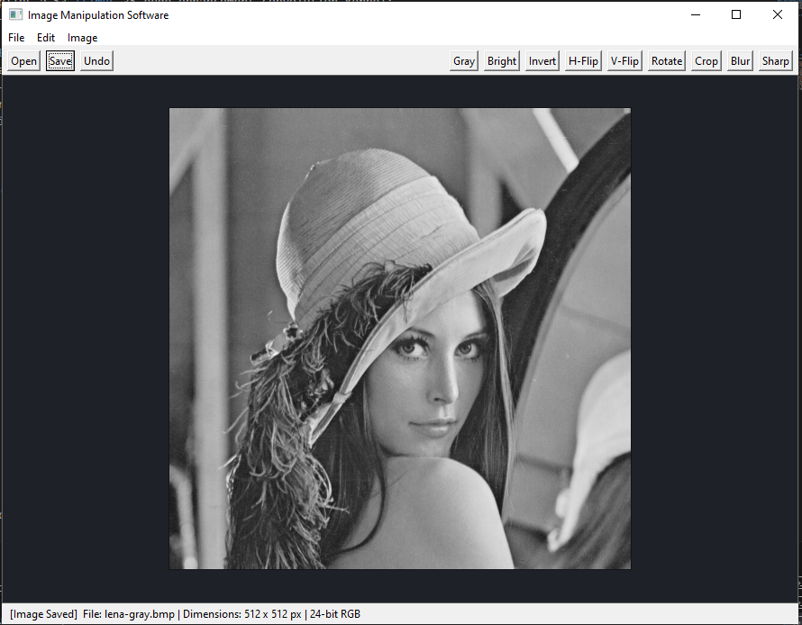</td>
  </tr>
  <tr>
    <td align="center"><b>Brightness +100</b><br>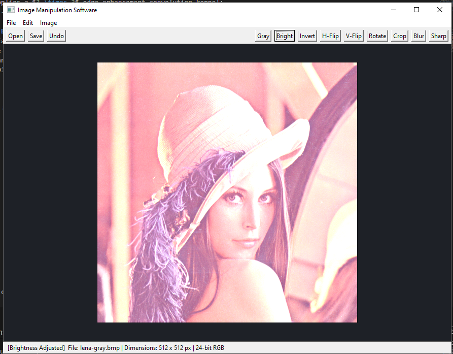</td>
    <td align="center"><b>Brightness -100</b><br>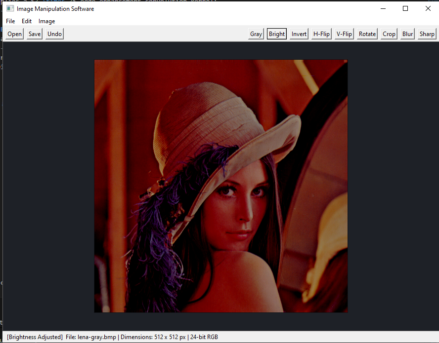</td>
    <td align="center"><b>Invert Colors</b><br>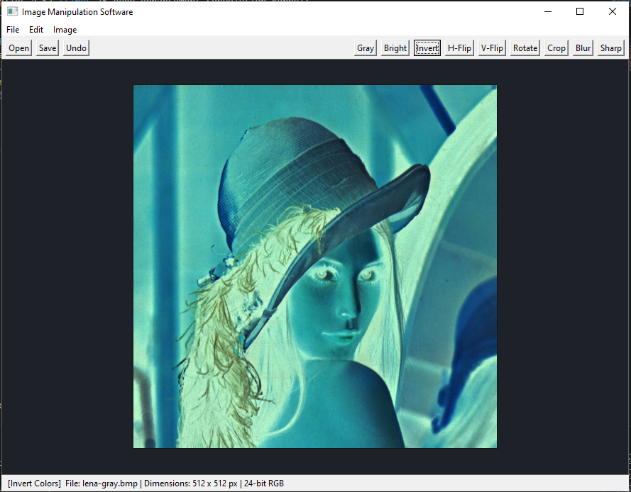</td>
  </tr>
  <tr>
    <td align="center"><b>Horizontal Flip</b><br>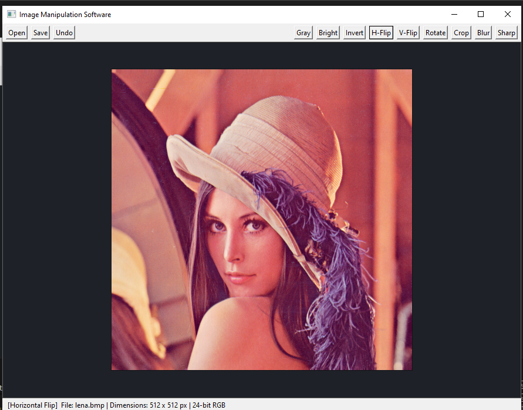</td>
    <td align="center"><b>Vertical Flip</b><br>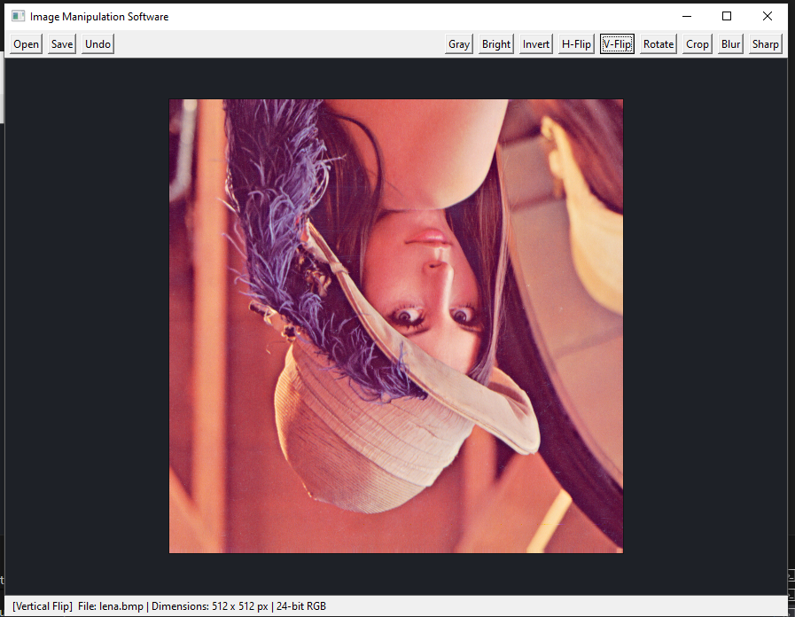</td>
    <td align="center"><b>Rotate 90° CW</b><br>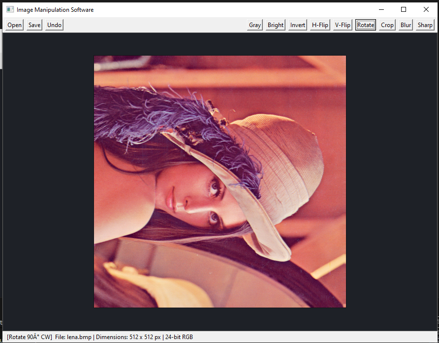</td>
  </tr>
  <tr>
    <td align="center"><b>Crop</b><br>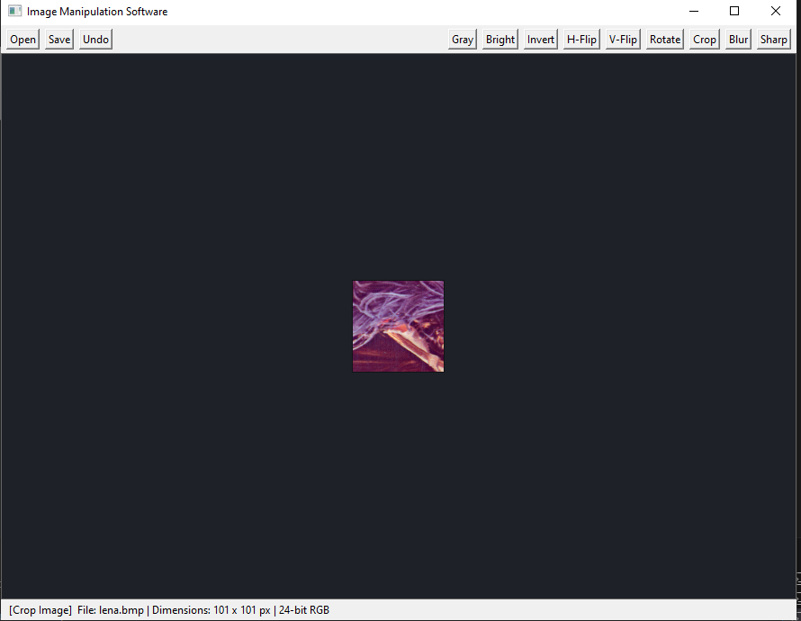</td>
    <td align="center"><b>Box Blur</b><br>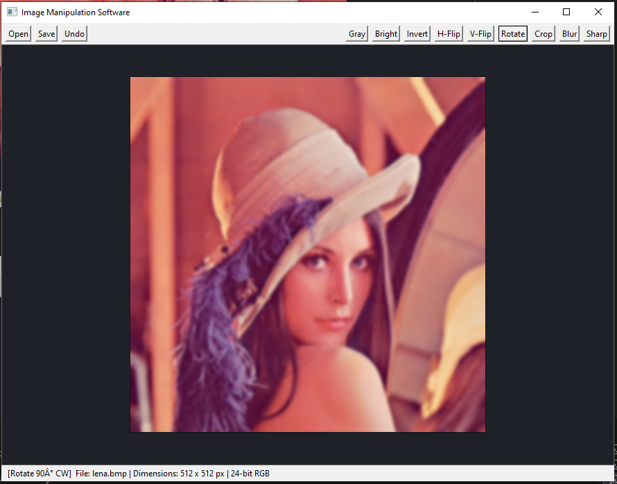</td>
    <td align="center"><b>Sharpen</b><br></td>
  </tr>
</table>

